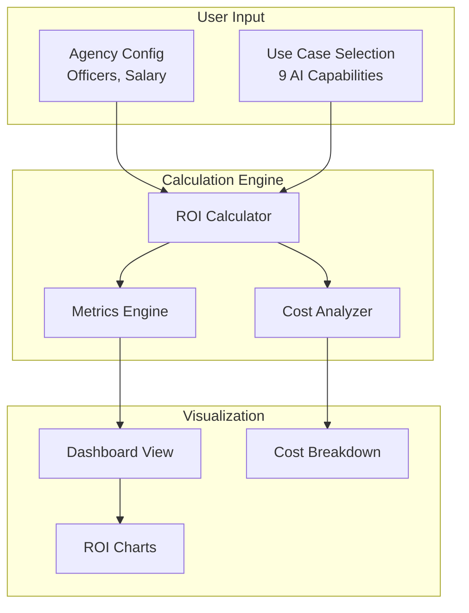
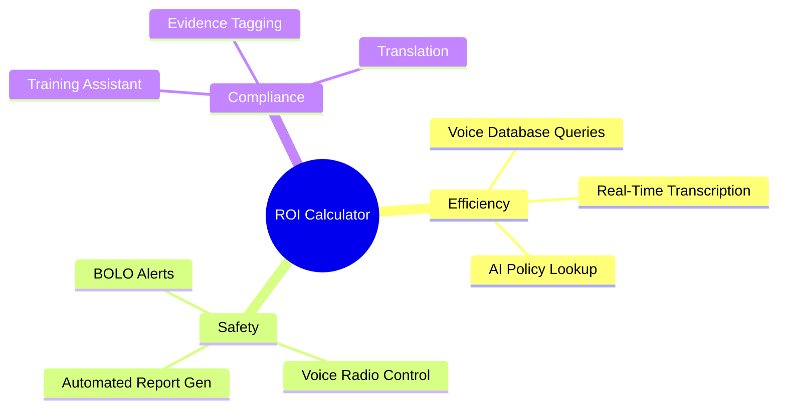
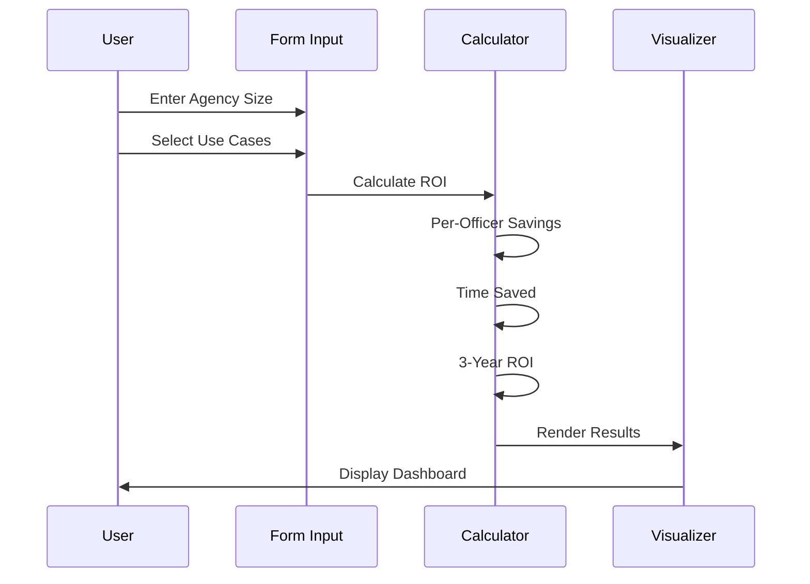
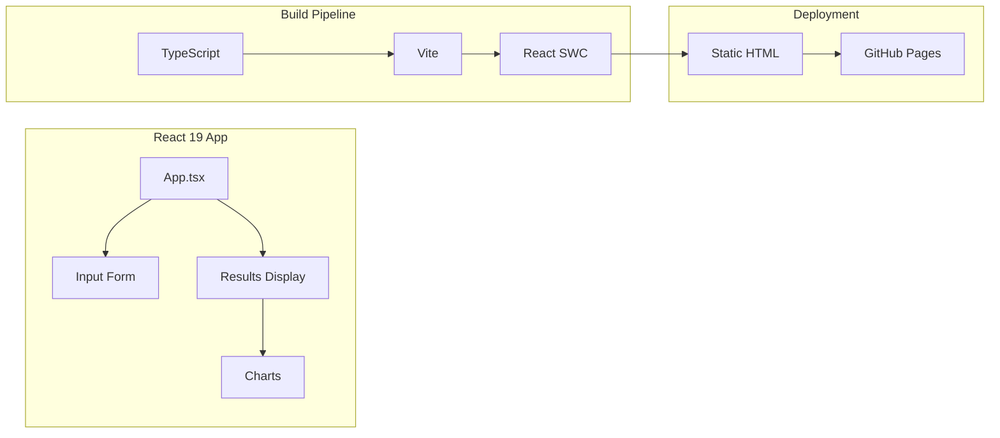

# AI Solutions ROI Calculator Architecture

## System Overview

## Use Case Categories

## Component Flow

## Application Structure

## ROI Metrics by Use Case

| Use Case | Savings/Officer/Year | Time Saved/Year |
|----------|---------------------|-----------------|
| Voice Database Queries | $4,200 | 156 hours |
| Real-Time Transcription | $3,600 | 120 hours |
| AI Policy Lookup | $2,400 | 80 hours |
| Automated Report Generation | $5,400 | 180 hours |

---
*Built by [QbitLoop](https://github.com/QbitLoop)*
